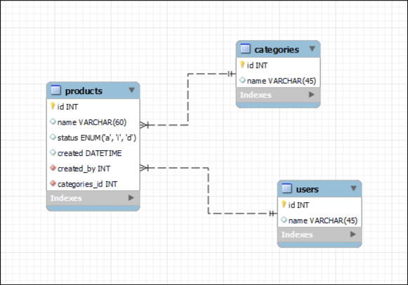

# Teste para candidatos à vaga de Desenvolvedor Fullstack Junior

Olá caro desenvolvedor, neste teste analisaremos seu conhecimento em desenvolvimento de software para ocupar o cargo de seu interesse, à seguir explicaremos tudo o que será necessário.

## Instruções

O desafio consiste em implementar uma API e um ambiente web utilizando Angular e/ou React para a interface e Node.js ou PHP com um framework (CakePHP, ou outro de sua preferência) para a API, e gerir/implementar um banco de dados relacional SQLite, MySQL ou Postgres (a seu critério), a partir de uma modelagem de dados inicial sugerida.

Você vai criar uma aplicação de cadastro de produtos para um e-commerce, com as seguintes funcionalidades:
- A tabela de categorias e usuários do banco de dados deve ser populada por quaisquer itens, não é necessário criar um crud para ela;
- É necessário que no cadastro e edição do produto tenha possibilidade de ler e enviar uma imagem para upload;
- CRUD de produtos.
    - a listagem dos produtos deve ser filtrável e ordenável por qualquer campo, e possuir paginação de 20 itens por página.
    - deve possuir formulários para criação e atualização de seus itens.
    - deve permitir a deleção de qualquer item de sua lista.

## Modelo de dados

O modelo de dados sugerido inicialmente é o seguinte:

  

Se você achar necessário poderá criar ou alterar o modelo de dados, mas minimamente estes campos e dados deverão estar presentes.
Além disso, a implementação deste modelo em um banco de dados relacional deve ser realizada levando em consideração os seguintes requisitos:
- Para criação do modelo de dados o banco de dados deve ser criado utilizando migrations e seeds para popular as informações;
- Implementação das validações necessárias na camada que julgar melhor;

## Tecnologias a serem utilizadas

Devem ser utilizadas as seguintes tecnologias:
- HTML
- CSS
- Javascript
- Framework CakePHP (PHP) ou Node.js
- Angular ou React;

## Entrega
- Para iniciar o teste, faça um fork deste repositório; Se você apenas clonar o repositório não vai conseguir fazer push.
- Crie uma branch com o seu nome completo;
- Altere o arquivo README.md(este) com as informações necessárias para executar o seu teste
- Envie-nos o pull request (tenha certeza que seu repositório nos dará acesso!);

## Bônus (Não obrigatórios)
- Implementar autenticação de usuário na aplicação.
- Permitir que o usuário mude o número de itens por página na listagem de produtos.
- Permitir deleção em massa de produtos.
- Implementar a camada de front-end utilizando bootstrap e que seja responsiva.
- Criação do ambiente com Docker.
- E o que mais sua mente permitir!

## O que iremos analisar
- Organização do código;
- Aplicação de design patterns;
- Separação de módulos e componentes;
- Legibilidade;

# Boa sorte!
